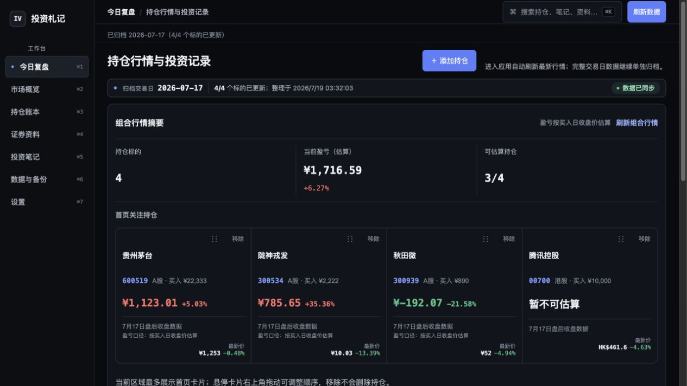
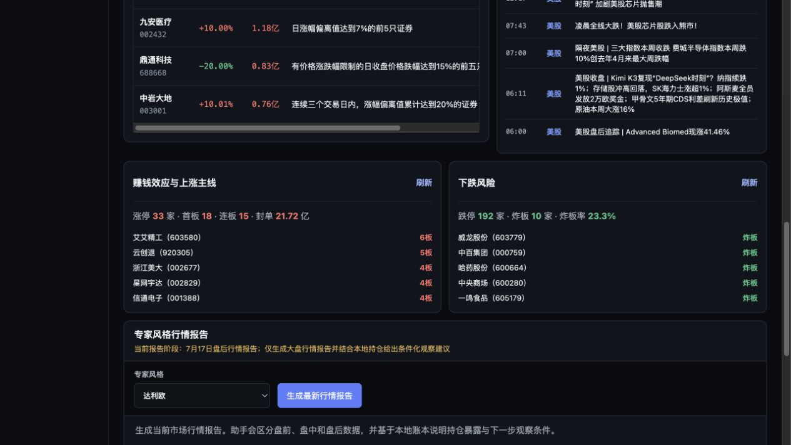
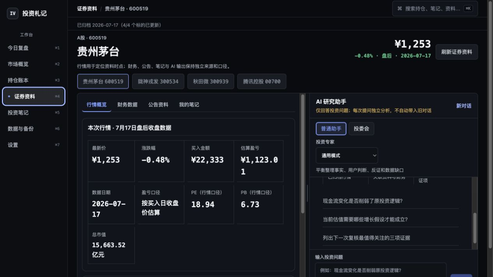
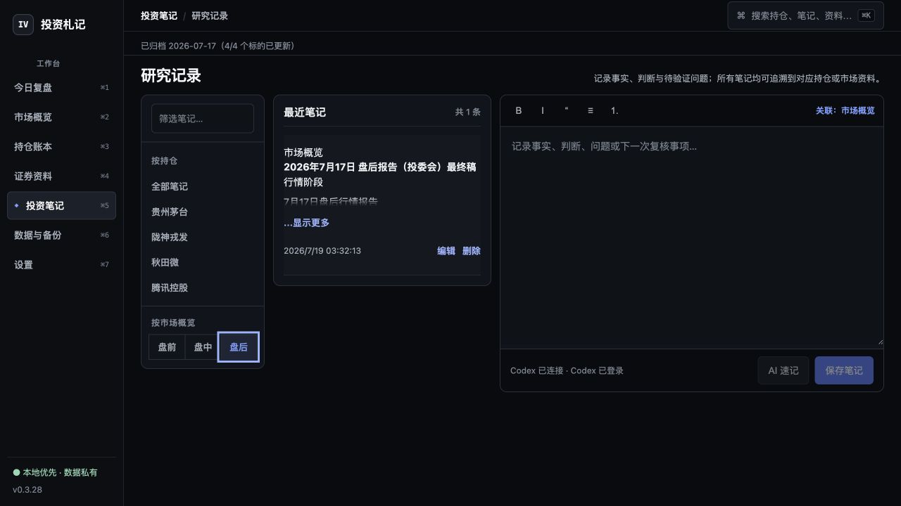

# 投资札记（Invest Vault）

> 把持仓、公开证据、自己的判断和每次复盘，留在一台 Mac 上。

**投资札记**是一款面向中国个人投资者的本地优先投资研究工作台。它不是券商终端，也不替你给出买卖指令；它更像一份持续更新、可以回溯的投资档案：整理 A 股、港股和基金持仓，归档行情与公开资料，记录当时的判断，并在下一次复盘时告诉你“当时知道什么、后来发生了什么”。



> 截图使用独立的公开演示账本和公开行情，不包含真实用户持仓或私人笔记。

## 它适合谁

- 同时持有 A 股、港股或基金，希望用同一套口径整理资料的中国投资者。
- 不想把持仓金额、买入日期和研究笔记默认上传到第三方服务的人。
- 需要定期复盘，而不是只盯着一张实时 K 线的人。
- 希望 AI 能引用资料、指出缺口，但不希望 AI 把推断冒充事实的人。
- 想保留自己的研究记录，并能导出、备份和迁移的人。

## 常见使用场景

### 每日持仓复盘

进入应用后自动更新最新公开行情，并把完整交易日数据单独归档。首页用有限数量的卡片显示持仓、估算盈亏、最新价格/净值、当日涨跌、数据日期和估算口径；长基金名称、代码和状态不会互相遮挡。组合行情与持仓事项可以独立刷新，不必等待另一类数据。

估算盈亏基于用户录入的人民币买入金额、买入日公开收盘价或净值与最新公开行情。它不是券商确认的成交数量或账户市值，界面会持续保留这一边界。

### 理解今天的市场环境

市场概览集中展示 13 个 A 股、港股和美股主要指数，以及龙虎榜、行业资金流、涨停/跌停结构、盘前持仓资讯和最近 24 小时的大盘新闻。每个栏目都可以独立刷新，刷新龙虎榜或持仓资讯不会让其他模块跟随重载。不同市场各自保留交易日期与盘前、盘中、盘后状态；单一来源失败不会清空其他栏目。



A 股颜色遵循红涨绿跌：净流入、涨停数量、板数与上涨主线使用红色；净流出、跌停、炸板与下跌风险使用绿色。

24 小时大盘新闻固定展示最新 6 条，保留发布时间、市场标签、来源链接和独立刷新。标题只作为公开资讯入口，不自动成为公司事实、因果结论或投资建议。

### 把基金和股票资料放回持仓语境

股票资料整理行情、财务、公告和笔记；基金使用正式单位净值、费用、基金经理、近期事件和公开持仓资料，不套用股票财报模板。资料区与研究助手并排，方便边核对证据边提问。



### 建立可以回看的投资记录

笔记支持标题、强调、引用、列表和表格等 Markdown 语义，但阅读界面不会暴露原始标记。持仓笔记与市场概览笔记分开管理；市场笔记再按盘前、盘中、盘后三个明确阶段归档，不根据创建时间猜测阶段。投委会或单专家的最终报告与中间结论保留确定性标题。



搜索可以同时命中持仓、关联笔记和公开资料；Markdown、Excel 与完整备份均由本地数据生成。

## 为什么不是又一个行情 App

- **本地优先**：持仓金额、买入日期、现金余额、风险约束、笔记和备份默认只保存在本机。
- **事实分层**：公开事实、应用计算、用户判断和可选 AI 输出是不同的数据类型，不互相覆盖。
- **缺口可见**：停牌、未披露、来源失败或样本不足会显示为缺口，不补零，也不生成漂亮但虚假的评分。
- **面向复盘**：保留数据日期、来源和历史记录，重点是判断如何形成、后来如何修订。
- **覆盖中国投资组合**：A 股、港股和人民币基金使用各自适合的数据结构与交易时段。
- **安装后独立运行**：DMG 内置应用服务、Web UI 和研究运行时；普通功能不要求 Python、Node.js、Rust、`stock-analysis` 仓库或任何 Codex/Hermes Skill。
- **AI 是可选项**：不安装或不登录 Codex 时，持仓、行情、资料、笔记、导出和备份仍可使用。

> 投资札记不连接券商、不下单、不预测价格，也不构成投资建议。

## 下载

请从本仓库的 [Releases 页面](../../releases/latest)下载，不要从第三方网盘或聊天附件安装。

当前公开版本：**0.3.29**。

| 平台 | 文件 | 状态 |
|---|---|---|
| macOS Apple Silicon（M1/M2/M3/M4） | `Invest-Vault_0.3.29-local-aarch64.dmg` | 使用 ad-hoc 签名；发布工作流完成构建、签名校验、DMG 校验与测试 |
| macOS Intel | 暂无 | 尚未构建原生 x86_64 sidecar |
| Windows | 暂无正式公开包 | 工作流可构建，但仍需 Windows 真机验收 |

### 校验下载文件

0.3.29 的 SHA-256 请以同一 GitHub Release 内附带的 `SHA256SUMS.txt` 为准。

在“终端”中执行：

```bash
shasum -a 256 ~/Downloads/Invest-Vault_0.3.29-local-aarch64.dmg
```

只有输出与上面的值完全一致时才继续安装。SHA-256 用于确认下载文件与本项目发布的文件一致，但它不能替代 Apple 公证或恶意软件检测。

## macOS 安装：没有 Apple 公证时如何打开

### 为什么会出现安全提示

当前安装包没有使用 Apple Developer ID，也没有提交 Apple 公证。包内仅使用 ad-hoc 签名维持应用组件完整性，因此从 GitHub 下载后，Gatekeeper 会把它视为“无法验证开发者”或“Apple 无法检查是否包含恶意软件”。GitHub 托管不会自动让应用获得 Apple 信任。

Apple 官方说明：[打开来自身份不明开发者的 Mac App](https://support.apple.com/guide/mac-help/open-a-mac-app-from-an-unknown-developer-mh40616/mac)、[安全地打开 Mac App](https://support.apple.com/102445)。

### 推荐安装步骤

以下步骤不需要开发者证书，也不需要用户在本机重新签名：

1. 从本仓库 Releases 下载 DMG，并按上一节核对 SHA-256。
2. 双击 DMG，把“投资札记.app”拖到“应用程序”文件夹。
3. 在“应用程序”中双击“投资札记”。macOS 会先阻止启动；关闭该提示，不要把来源不明或校验不一致的文件加入例外。
4. 打开“系统设置” → “隐私与安全性”，向下滚动到“安全性”。
5. 找到关于“投资札记”的提示，点击“仍要打开”（部分系统显示为“打开”）。该按钮通常只在刚刚尝试启动应用后约一小时内出现。
6. 输入本机登录密码或使用 Touch ID，再次点击“打开”。
7. 以后可以像普通应用一样双击启动，不需要重复操作。

如果看不到“仍要打开”，请回到第 3 步再次尝试启动，然后立刻返回“隐私与安全性”。旧版 macOS 可能允许在 Finder 中按住 Control 点击 App 后选择“打开”，但新版系统不保证保留这条路径，因此不要把它作为首选步骤。

### 无法绕过的情况

- 公司、学校或其他受管理的 Mac 可能由 MDM/管理员禁止“仍要打开”；这种设备上无法保证安装，需联系管理员。
- 当前 DMG 仅支持 Apple Silicon，Intel Mac 不能通过绕过 Gatekeeper 来解决架构不兼容。
- 如果 macOS 明确报告文件已损坏、签名结构无效，或 SHA-256 不一致，请删除文件并在 Releases 重新下载，不要继续绕过安全检查。

不建议执行 `sudo spctl --master-disable`、全局关闭 Gatekeeper，或复制来源不明的 `xattr` 命令。官方“仍要打开”只为这一款 App 建立例外，影响范围更小。

## 第一次使用

1. 添加持仓代码、资产类型、人民币买入金额和买入日期。
2. 等待应用读取可核验的买入日价格/净值和最新公开行情。
3. 在“今日复盘”查看组合摘要、待处理事项和笔记。
4. 在“证券资料”核对股票或基金资料，并把自己的判断写入笔记。
5. 在“数据与备份”创建本地完整备份。

macOS 数据目录：

```text
~/Library/Application Support/Invest Vault/
```

删除 App 不会自动删除这个目录。升级前建议先在“数据与备份”页创建完整备份。

## 数据来源与独立运行说明

应用通过项目自身的 Python 适配器访问公开数据源，包括腾讯财经、东方财富、天天基金、港交所披露易、Sina 和 Futu 公开资讯搜索等。来源可用性和返回内容可能随第三方服务变化；应用会保留来源、日期和失败状态。

### Futu 新闻是否依赖本地 Skill？

**不依赖。** `futu-news-search` 只在开发阶段提供了数据源使用规范；安装后的应用不会查找、加载或执行用户机器上的这个 Skill。

- 运行时代码位于项目自己的 `src/invest_vault/providers.py`，直接调用 Futu 的公开资讯搜索接口。
- 应用自己完成 24 小时时间窗、市场范围过滤、去重、排序、数量限制和失败处理。
- PyInstaller 成品中包含上述 Python 代码，不包含也不需要 `futu-news-search` Skill。
- 因此用户无需安装 Codex、Hermes 或任何前端/新闻 Skill 才能查看市场新闻。

项目与富途不存在隶属、授权或合作关系；“富途”仅用于标识公开资讯来源。来源条款、可用性和内容版权归相应权利人所有。

## 可选 AI 研究助手

AI 速记与研究助手默认通过本机 [Codex CLI](https://developers.openai.com/codex/cli/) 的 `app-server` 使用用户已有的 ChatGPT/Codex 登录态。应用不读取或保存 `~/.codex/auth.json`、access token 或 refresh token；登录和凭据刷新由 Codex 管理。也可以按任务选择自带 OpenAI、Anthropic、Google Gemini 或 DeepSeek API key。

- 普通持仓、市场、资料、笔记和导出功能不依赖 Codex。
- 自带 API key 使用 AES-256-GCM 加密后写入本地 SQLite，页面只显示末 4 位；主密钥单独保存在权限为 0600 的本机文件中。保存 key 不会调用 Provider，首次生成才可能产生对应 API 费用。
- AI 每次只读取当前任务所需的有界本地上下文，不上传整个数据库或附件目录。
- 每个问题作为独立模型回合，不自动把旧问答当作上下文。
- DMG 内置 `stock-analysis 4.12.0` 的只读方法资产与 Python 运行时，用户不需要另行安装该仓库或 Skill。
- 研究助手可选择普通模式、投委会和 15 种分析框架；这些是分析方法，不冒充真人观点。
- AI 结果与公开事实分开保存；用户核对、编辑并确认后才成为正式笔记。
- ChatGPT 套餐的 Codex 可用性与额度由 OpenAI 账户决定，AI 失败不会影响已有 Vault 数据。

## 证据覆盖与边界

| 场景 | 当前可核验的内容 | 仍不应宣称完整的部分 |
|---|---|---|
| A 股 | 主要指数、标的行情、当前估值、公开财务报表、公告、候选同行和部分历史量价 | 未披露报告期、未经确认的同行可比性、新闻尚未证实的经营细节 |
| 港股 | 主要指数、标的行情、当前估值、市值和港交所官方披露原文 | 尚无统一可靠的结构化三表适配器，需回到报告原文 |
| 基金 | 官方净值、公开费率/规模/经理、最近披露持仓及组合相关性 | 披露持仓不是实时持仓；规模变化不是净申赎；价格序列不能证明回撤原因 |

相关性至少需要 60 个重合日收益样本；不足时不输出数值。现金余额和最大可承受回撤是用户输入的本地约束，应用和 AI 不会从市场波动中猜测。

## 从源码运行

需要 Python 3.9+、[uv](https://docs.astral.sh/uv/) 和 Node.js 22+：

```bash
git clone https://github.com/AdvancingTitans/invest-vault.git
cd invest-vault

npm ci --prefix web
npm run build --prefix web
uv run invest-vault
```

然后访问 <http://127.0.0.1:8765>。源码运行只监听本机回环地址。

构建 macOS 桌面包还需要 Rust：

```bash
uv run --extra dev --with pyinstaller python scripts/build_sidecar.py
npx --yes @tauri-apps/cli@latest build --bundles app
codesign --force --deep --sign - "src-tauri/target/release/bundle/macos/投资札记.app"
```

完整打包命令见 [PACKAGING.md](PACKAGING.md)。

## 开发验证

```bash
uv run --extra dev pytest -q
uv run ruff check src tests
npm run build --prefix web
cargo test --manifest-path src-tauri/Cargo.toml
```

## 许可证

本项目采用 **AGPL-3.0 + Commons Clause** 授权，详见 [LICENSE](LICENSE)：

- 允许个人使用、公司内部自用、fork、学习和修改。
- 修改后对外提供网络服务时，需要按 AGPL-3.0 提供对应源码。
- **禁止出售本软件**：不得把本软件本体或其实质功能作为收费产品、托管服务、付费咨询或付费支持提供给第三方。
- 该组合不是 OSI 认证的开源许可证，属于 source-available。

第三方数据、品牌、公开资料和随包依赖仍分别受其原有条款约束。
