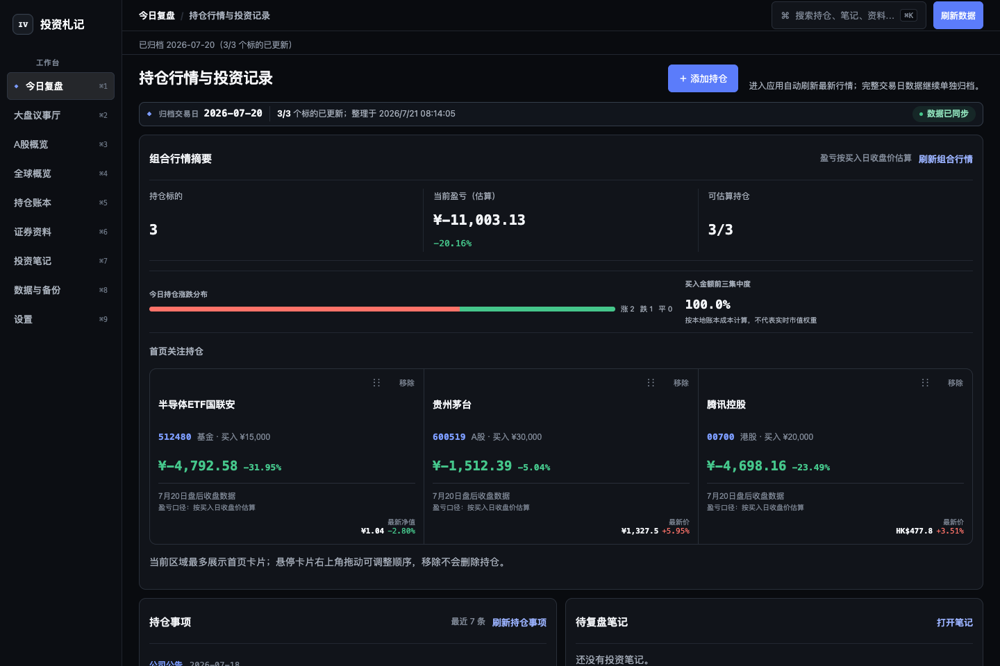
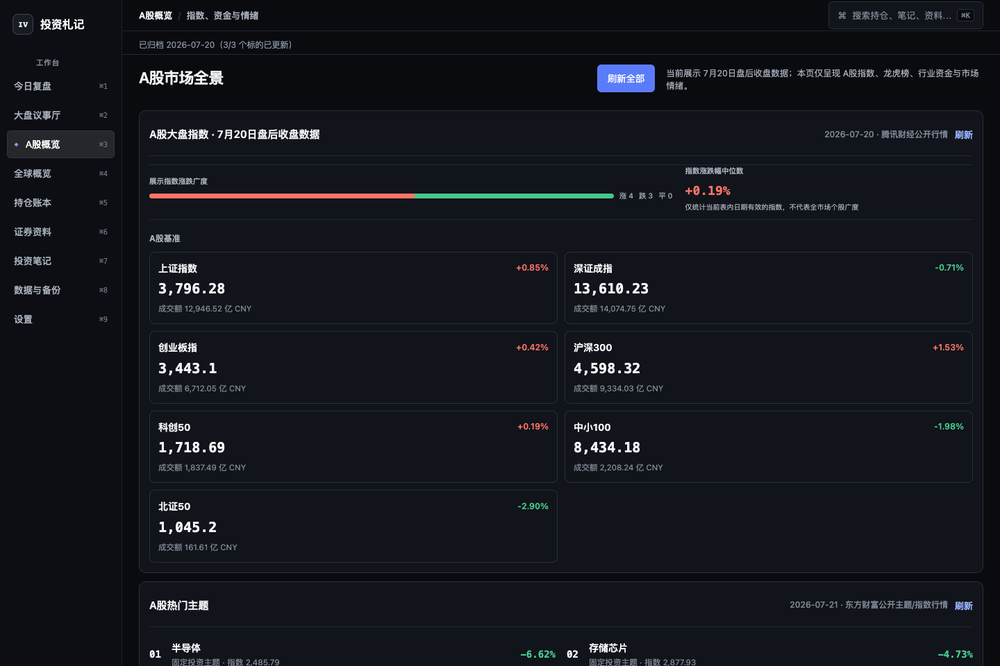
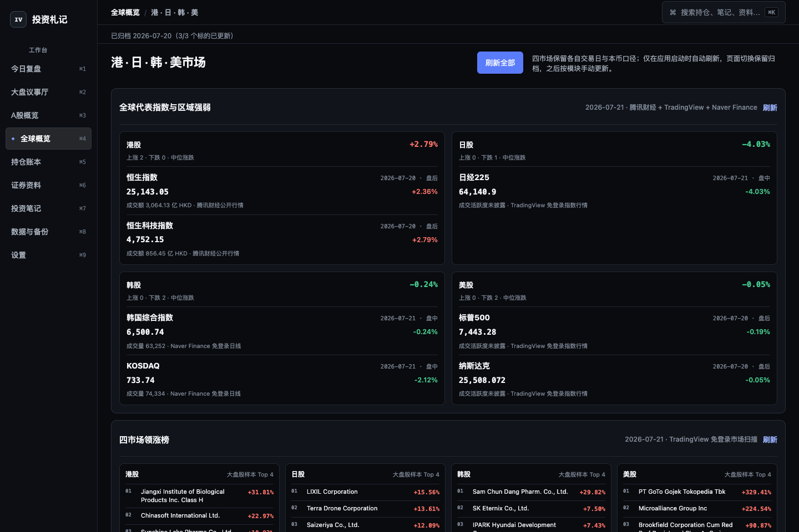
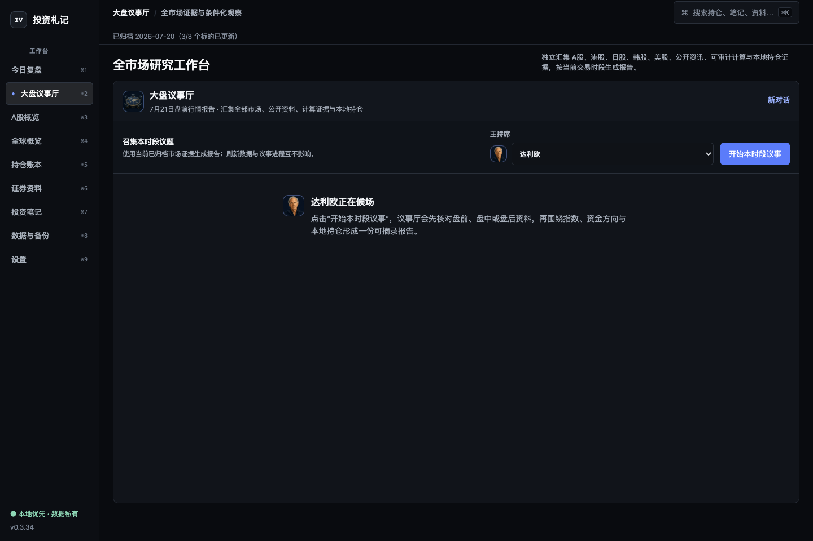
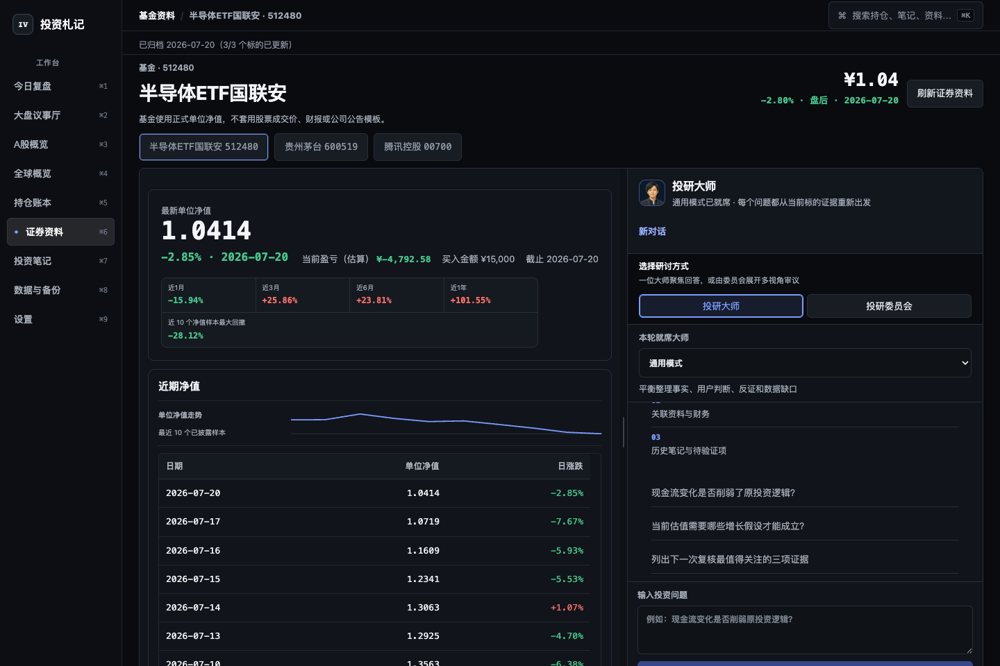
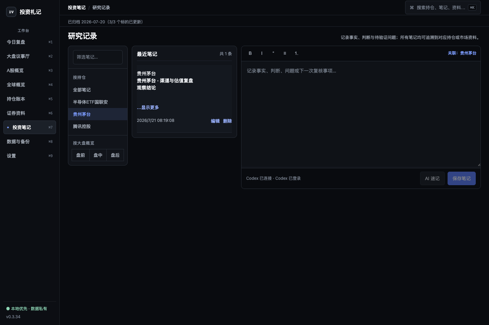

# 投资札记（Invest Vault）

> 把持仓、公开证据、自己的判断和每次复盘，留在一台 Mac 上。

**投资札记**是一款面向中国个人投资者的本地优先投资研究工作台。它不是券商终端，也不替你给出买卖指令；它把持仓与市场证据放进同一份可回溯档案：归档当时可见的公开事实、可复算指标、自己的判断和后续复盘。



> 截图使用独立的公开演示账本和公开行情，不包含真实用户持仓或私人笔记。

## 0.3.54 更新重点

- **只发布证据支持的结论**：大盘议事厅、投研大师和投研委员会的最终正文只保留带支持证据的 `supported` 结论，以及同时具备支持证据和可复核条件的 `conditional` 结论；“证据不足、无法判断、维持观察、不能给出结论”等缺口式元结论留在本地审计状态，不作为报告结论发布。
- **本地笔记完全不进入 AI 证据包**：证券笔记和市场笔记继续保存在 Vault 中供用户阅读、搜索和编辑，但不会被装配为任何 AI 场景的证据、提示词或引用来源。
- **公开报告与内部审计分层**：完整 Evidence Store、Coverage、open questions、冲突和风险状态仍保存在本地；最终报告只读取可发布 Claim 投影，引用必须属于本轮证据。
- **港、日、韩、美市场概览**：按各市场真实交易日和交易时段展示代表指数、区域涨跌、成交活跃度、领涨榜、主题、财报日历和市场新闻；日股、韩股不再只是新闻补充，而是完整的市场分区。
- **独立大盘议事厅**：与“今日复盘”平级，汇集 A/HK/JP/KR/US 市场、公开资料、应用计算和本地持仓证据，按当前交易时段生成条件化观察报告。
- **更完整的专家证据链**：投研大师和投研委员会保留完整上游财务、基金、估值、量价、微观结构及执行证据；缺口按 `stock-analysis`、一手原文回填和 Agent Reach 顺序在审计层补强。
- **本地账本是唯一持仓权威**：AI 只接受应用内账本的名称、代码、类型、买入日期和买入金额；外部 profile、旧对话或模型记忆不能引入 TSLA 等账本外持仓。
- **A股页面收敛**：六个固定可核验主题采用双列布局；A股大盘新闻严格过滤非 A 股个股新闻，可放宽发布时间以凑齐 6 条，部分结果不会覆盖最近完整归档。
- **桌面与窄屏布局复核**：完成 1440px、760px、390px 响应式验收，修正龙虎榜/新闻底边、跨模块空白、长文本和停止生成提示裁切。

## 它适合谁

- 同时持有 A 股或基金，又需要观察港股、日股、韩股、美股和跨市场风险的中国投资者。
- 不想把持仓金额、买入日期和研究笔记默认上传到第三方服务的人。
- 需要定期复盘，而不是只盯着一张实时 K 线的人。
- 希望 AI 最终只发布可引用、可复核结论，同时在本地保留完整缺口审计的人。
- 想保留自己的研究记录，并能导出、备份和迁移的人。

## 常见使用场景

### 每日持仓复盘

应用启动时会自动更新一次最新公开行情，并把完整交易日数据单独归档；页面切换、窗口重新获得焦点和固定时刻不再自动联网，之后完全由用户按模块手动刷新。首页先显示本地归档，再用有限数量的卡片显示持仓、估算盈亏、最新价格/净值、当日涨跌、数据日期和估算口径；长基金名称、代码和状态不会互相遮挡。移除卡片只改变首页关注列表，空位上的“＋”可以从持仓账本导入尚未展示的个股或基金。组合行情与持仓事项可以独立刷新，不必等待另一类数据。

估算盈亏基于用户录入的人民币买入金额、买入日公开收盘价或净值与最新公开行情。它不是券商确认的成交数量或账户市值，界面会持续保留这一边界。

### 理解今天的市场环境

市场数据拆为两个边界明确的固定投影。A股概览展示 7 个 A 股基准、双列固定的半导体/存储芯片/算力概念/通信设备/人工智能/人形机器人主题、国内财报预约表、龙虎榜、行业资金流、涨停/跌停结构、盘前持仓资讯和 A 股大盘新闻；赚钱效应与上涨主线、下跌风险都标明真实数据日期。



全球概览按港股、日股、韩股、美股分别保留市场交易日、盘前/盘中/盘后状态、代表指数、区域中位涨跌和可核验成交活跃度，并提供四市场领涨榜、投资主题、列表式财报日历和最近 24 小时全球市场新闻。日股使用 XTKS 日历、日经 225 与 `.T` 标的证据；韩股使用 XKRX 日历、KOSPI/KOSDAQ 与 `.KS`/`.KQ` 标的证据。每个栏目可以独立刷新，单一来源失败不会覆盖其他模块。



A 股颜色遵循红涨绿跌：净流入、涨停数量、板数与上涨主线使用红色；净流出、跌停、炸板与下跌风险使用绿色。

A 股新闻固定展示 6 条：先以严格 A 股市场语义筛选，再按发布时间倒序补足，不以 24 小时截断数量；不足 6 条的刷新不会覆盖最近一次完整归档。全球新闻最多展示 8 条。两者都保留完整发布时间、市场标签、来源链接和独立刷新。标题只作为公开资讯入口，不自动成为公司事实、因果结论或投资建议。

### 用大盘议事厅做跨市场时段报告

大盘议事厅是与今日复盘平级的一级工作台，不嵌在 A股概览或全球概览内。它读取当前归档的全部相关市场证据，而不是只读取页面上可见的几行；开始议事不会强制刷新或改变市场页面。单专家或六席投研委员会会先核对当前交易时段，再把本地持仓作为条件化观察语境。最终报告只发布本轮证据支持的事实判断和具备可复核触发条件的条件结论，不输出交易指令，也不把证据缺口写成结论。



### 把基金和股票资料放回持仓语境

股票资料整理行情、估值、财务趋势、公告和笔记；基金使用正式单位净值、阶段收益、样本回撤、规模变化、费用、基金经理、近期事件和公开持仓资料，不套用股票财报模板。资料区与“投研大师”并排，方便边核对证据边展开研究。15 位投资框架使用统一的本地插画头像。全市场大盘议事厅标题栏、其“投研委员会 · 六席会审”席位，以及证券资料的投研委员会标题使用圆桌头像；单专家选择、专家发言、协调员、证据研究员和投资经理仍使用各自的专家或任务头像，不冒充专家。



### 建立可以回看的投资记录

笔记支持标题、强调、引用、列表和表格等 Markdown 语义，但阅读界面不会暴露原始标记。持仓笔记与大盘概览笔记分开管理；市场笔记再按盘前、盘中、盘后三个明确阶段归档，不根据创建时间猜测阶段。笔记始终是独立的用户记录，不会进入 AI 证据包。投研委员会或单专家的最终报告与中间结论保留确定性标题。



搜索可以同时命中持仓、关联笔记和公开资料；Markdown、Excel 与完整备份均由本地数据生成。

## 为什么不是又一个行情 App

- **本地优先**：持仓金额、买入日期、现金余额、风险约束、笔记和备份默认只保存在本机。
- **事实分层**：公开事实、应用计算、用户判断和可选 AI 输出是不同的数据类型，不互相覆盖。
- **缺口可审计**：停牌、未披露、来源失败或样本不足保留在资料状态和本地研究审计中，不补零，也不生成漂亮但虚假的评分；AI 最终报告不把缺口本身写成投资结论。
- **面向复盘**：保留数据日期、来源和历史记录，重点是判断如何形成、后来如何修订。
- **本地持仓 + 全球语境**：A 股、港股和人民币基金使用各自的数据结构；港、日、韩、美市场按各自日历和时段提供组合外部环境证据。
- **安装后独立运行**：DMG 内置应用服务、Web UI 和研究运行时；普通功能不要求 Python、Node.js、Rust、`stock-analysis` 仓库或任何 Codex/Hermes Skill。
- **AI 是可选项**：不安装或不登录 Codex 时，持仓、行情、资料、笔记、导出和备份仍可使用。

> 投资札记不连接券商、不下单、不预测价格，也不构成投资建议。

## 下载

请从本仓库的 [Releases 页面](../../releases/latest)下载，不要从第三方网盘或聊天附件安装。

当前公开版本：**0.3.54**。

| 平台 | 文件 | 状态 |
|---|---|---|
| macOS Apple Silicon | `Invest-Vault_0.3.54-local-aarch64.dmg` | 使用 ad-hoc 签名；发布包已完成构建、挂载、签名、冻结服务、DMG 校验和三类真实 AI 报告验收 |
| macOS Intel | 暂无 | 尚未构建原生 x86_64 sidecar |
| Windows | 暂无正式公开包 | 工作流可构建，但仍需 Windows 真机验收 |

### 校验下载文件

0.3.54 的 SHA-256：

```text
fe606ff282e9013d724bbd7f77c4f982099a8eb4365beff344e40d4edba152e0  Invest-Vault_0.3.54-local-aarch64.dmg
```

在“终端”中执行：

```bash
shasum -a 256 ~/Downloads/Invest-Vault_0.3.54-local-aarch64.dmg
```

只有输出与上面的值完全一致时才继续安装。SHA-256 用于确认下载文件与本项目发布的文件一致，但它不能替代 Apple 公证或恶意软件检测。

## macOS 安装：没有 Apple 公证时如何打开

### 为什么会出现安全提示

当前安装包没有使用 Apple Developer ID，也没有提交 Apple 公证。包内仅使用 ad-hoc 签名维持应用组件完整性，因此从 GitHub 下载后，Gatekeeper 会把它视为“无法验证开发者”或“Apple 无法检查是否包含恶意软件”。GitHub 托管不会自动让应用获得 Apple 信任。

Apple 官方说明：[打开来自身份不明开发者的 Mac App](https://support.apple.com/guide/mac-help/open-a-mac-app-from-an-unknown-developer-mh40616/mac)、[安全地打开 Mac App](https://support.apple.com/102445)。

### 推荐安装步骤

以下步骤不需要开发者证书，也不需要用户在本机重新签名：

1. 从本仓库 Releases 下载 DMG，并按上一节核对 SHA-256。
2. 双击 DMG，把“投资札记.app”拖到“应用程序”文件夹。
3. 在“应用程序”中双击“投资札记”。macOS 会先阻止启动；关闭该提示，不要把来源不明或校验不一致的文件加入例外。
4. 打开“系统设置” → “隐私与安全性”，向下滚动到“安全性”。
5. 找到关于“投资札记”的提示，点击“仍要打开”（部分系统显示为“打开”）。该按钮通常只在刚刚尝试启动应用后约一小时内出现。
6. 输入本机登录密码或使用 Touch ID，再次点击“打开”。
7. 以后可以像普通应用一样双击启动，不需要重复操作。

如果看不到“仍要打开”，请回到第 3 步再次尝试启动，然后立刻返回“隐私与安全性”。旧版 macOS 可能允许在 Finder 中按住 Control 点击 App 后选择“打开”，但新版系统不保证保留这条路径，因此不要把它作为首选步骤。

### 无法绕过的情况

- 公司、学校或其他受管理的 Mac 可能由 MDM/管理员禁止“仍要打开”；这种设备上无法保证安装，需联系管理员。
- 当前 DMG 仅支持 Apple Silicon，Intel Mac 不能通过绕过 Gatekeeper 来解决架构不兼容。
- 如果 macOS 明确报告文件已损坏、签名结构无效，或 SHA-256 不一致，请删除文件并在 Releases 重新下载，不要继续绕过安全检查。

不建议执行 `sudo spctl --master-disable`、全局关闭 Gatekeeper，或复制来源不明的 `xattr` 命令。官方“仍要打开”只为这一款 App 建立例外，影响范围更小。

## 第一次使用

1. 添加持仓代码、资产类型、人民币买入金额和买入日期。
2. 等待应用读取可核验的买入日价格/净值和最新公开行情。
3. 在“今日复盘”查看组合摘要、待处理事项和笔记。
4. 在“证券资料”核对股票或基金资料，并把自己的判断写入笔记。
5. 在“数据与备份”创建本地完整备份。

macOS 数据目录：

```text
~/Library/Application Support/Invest Vault/
```

删除 App 不会自动删除这个目录。升级前建议先在“数据与备份”页创建完整备份。

## 数据来源与独立运行说明

应用通过项目自身的 Python 适配器访问公开数据源，包括腾讯财经、东方财富、TradingView 公共扫描接口、Naver Finance、天天基金、港交所披露易、Sina、Futu 公开资讯搜索，以及財経新聞、東洋経済、JPX 和韩国经济的公开 RSS。来源可用性和返回内容可能随第三方服务变化；应用会保留来源、日期和失败状态。

A股大盘新闻使用 A股大盘、A股市场、沪深股市三组严格查询，并以新浪滚动财经多页结果兜底；标题必须同时具备 A股范围词和市场语义，允许突破 24 小时以凑齐固定 6 条。若不足 6 条，本次刷新整体失败并保留最近完整归档。投资主题使用东方财富公开主题/指数行情的固定篮子，本月财报优先使用东方财富 A股财报预约表，失败时才降级到 TradingView。

全球概览按港、日、韩、美四个市场保留新闻，并在数据源可用时优先为每个市场留出席位；日股采用財経新聞 Market、東洋経済与 JPX，韩股采用 Naver Finance、韩国经济以及 DART/KIND/发行人原文回填。四市场同时展示代表指数、领涨榜、透明成分篮子主题和本月待披露代表公司。日经 225 使用 TradingView 公共扫描值交叉校验；东证指数在免费来源持续返回 403 时不展示，不用旧值或其他指数替代。标普 500 等指数只在来源提供可核验且大于零的成交量时展示活跃度，不以 0 占位。

### Futu 新闻是否依赖本地 Skill？

**不依赖。** `futu-news-search` 只在开发阶段提供了数据源使用规范；安装后的应用不会查找、加载或执行用户机器上的这个 Skill。

- 运行时代码位于项目自己的 `src/invest_vault/providers.py`，直接调用 Futu 的公开资讯搜索接口。
- 应用自己完成市场范围过滤、A股严格语义、发布时间排序、去重、数量与原子归档处理。
- PyInstaller 成品中包含上述 Python 代码，不包含也不需要 `futu-news-search` Skill。
- 因此用户无需安装 Codex、Hermes 或任何前端/新闻 Skill 才能查看市场新闻。

项目与富途不存在隶属、授权或合作关系；“富途”仅用于标识公开资讯来源。来源条款、可用性和内容版权归相应权利人所有。

## 可选 AI 投研伙伴

AI 速记、大盘议事厅、投研大师与投研委员会默认通过本机 [Codex CLI](https://developers.openai.com/codex/cli/) 的 `app-server` 使用用户已有的 ChatGPT/Codex 登录态。应用不读取或保存 `~/.codex/auth.json`、access token 或 refresh token；登录和凭据刷新由 Codex 管理。也可以按任务选择自带 OpenAI、Anthropic、Google Gemini 或 DeepSeek API key。

- 普通持仓、市场、资料、笔记和导出功能不依赖 Codex。
- 自带 API key 使用 AES-256-GCM 加密后写入本地 SQLite，页面只显示末 4 位；主密钥单独保存在权限为 0600 的本机文件中。保存 key 不会调用 Provider，首次生成才可能产生对应 API 费用。
- AI 每次装配当前任务所需的完整证据包，不上传整个数据库或附件目录；本地笔记在所有场景中都被排除，不成为证据、提示词或引用。证据、专家意见与最终综合之间不再按字符数截断。
- 每个问题作为独立模型回合，不自动把旧问答当作上下文。
- 应用内 Vault 账本是持仓唯一权威来源；名称、代码、类型、买入日期和买入金额完整进入研究上下文，外部 `stock-analysis` profile、环境变量 profile 与旧模型记忆被禁止，账本外持仓声明会被拒绝。
- DMG 内置 `stock-analysis 4.15.0` 的完整只读方法资产与 Python 运行时，并携带 `primary-evidence-reach` 原文回填流程；用户不需要另行安装该仓库或 Skill。
- 设置页会只读核对上游最新正式版。发现新版时仅提示，不会在运行中下载或覆盖代码；研究引擎随经过测试的新 Invest Vault Release 更新。
- 大盘议事厅按所处时段，结合当前可用证据和本地持仓生成条件化观察报告。A股、港股、日股、韩股、美股及应用内未展示的相关公开、计算和持仓证据均可进入；页面模块不是证据上限。专家先按内置 `stock-analysis` 路由补齐框架证据，具体缺口再由 Agent Reach 只读检索；只有输入充分、口径准确且业界通行的二次计算才会作为明确标注的计算证据。最终正文只投影受支持的 Claim 和具备支持证据、触发条件的条件 Claim；open questions、Coverage 缺口和失败原因仍在本地审计状态中，不进入公开结论。开始议事不强制刷新市场页面，页面刷新也不禁用或重置议事厅、投研大师和投研委员会。
- Agent Reach 或原文回填取得的发行人、交易所、监管机构、基金公司和指数公司页面以结构化来源进入最终引用；搜索摘要和二手片段不能冒充已核验原文。
- 大盘议事厅、投研大师和投研委员会在生成中均可停止；投研大师和投研委员会可按 Enter 发送、Shift+Enter 换行。不同角色以头像和独立发言呈现，但角色仍是分析方法，不冒充真人观点。
- AI 结果与公开事实分开保存；用户核对、编辑并确认后才成为正式笔记。
- ChatGPT 套餐的 Codex 可用性与额度由 OpenAI 账户决定，AI 失败不会影响已有 Vault 数据。

## 证据覆盖与边界

| 场景 | 当前可核验的内容 | 仍不应宣称完整的部分 |
|---|---|---|
| A 股 | 主要指数、标的行情、当前估值、公开财务报表、公告、候选同行和部分历史量价 | 未披露报告期、未经确认的同行可比性、新闻尚未证实的经营细节 |
| 港股 | 主要指数、标的行情、当前估值、市值和港交所官方披露原文 | 尚无统一可靠的结构化三表适配器，需回到报告原文 |
| 日股 | 经交叉校验的日经 225、`.T` 标的免费日线、XTKS 日历、条件性聚合财务与 TDnet/发行人原文回填 | 东证免费接口持续 403 时不展示；缺公告日期的财务不能升级为历史一手事实 |
| 韩股 | KOSPI/KOSDAQ 概览、`.KS`/`.KQ` 标的 Naver 日线与 Yahoo 交叉核对、XKRX 日历、DART/KIND/发行人原文回填 | 聚合财务缺公告日期时保持 conditional；跨源冲突不会静默选边 |
| 美股 | 主要指数、标的行情、SEC Company Facts 按 filing date 截止的结构化财务与 EDGAR/发行人原文 | 标准 XBRL 不能冒充分部、治理或渠道证据 |
| 基金 | 官方净值、公开费率/规模/经理、最近披露持仓及组合相关性 | 披露持仓不是实时持仓；规模变化不是净申赎；价格序列不能证明回撤原因 |

相关性至少需要 60 个重合日收益样本；不足时不输出数值。现金余额和最大可承受回撤是用户输入的本地约束，应用和 AI 不会从市场波动中猜测。

## 从源码运行

需要 Python 3.9+、[uv](https://docs.astral.sh/uv/) 和 Node.js 22+：

```bash
git clone https://github.com/AdvancingTitans/invest-vault.git
cd invest-vault

npm ci --prefix web
npm run build --prefix web
uv run invest-vault
```

然后访问 <http://127.0.0.1:8765>。源码运行只监听本机回环地址。

构建 macOS 桌面包还需要 Rust：

```bash
uv run --extra dev --with pyinstaller python scripts/build_sidecar.py
npx --yes @tauri-apps/cli@latest build --bundles app
codesign --force --deep --sign - "src-tauri/target/release/bundle/macos/投资札记.app"
```

完整打包命令见 [PACKAGING.md](PACKAGING.md)。

## 开发验证

```bash
uv run --extra dev pytest -q
uv run ruff check src tests
npm run build --prefix web
cargo test --manifest-path src-tauri/Cargo.toml
```

## 许可证

本项目采用 **AGPL-3.0 + Commons Clause** 授权，详见 [LICENSE](LICENSE)：

- 允许个人使用、公司内部自用、fork、学习和修改。
- 修改后对外提供网络服务时，需要按 AGPL-3.0 提供对应源码。
- **禁止出售本软件**：不得把本软件本体或其实质功能作为收费产品、托管服务、付费咨询或付费支持提供给第三方。
- 该组合不是 OSI 认证的开源许可证，属于 source-available。

第三方数据、品牌、公开资料和随包依赖仍分别受其原有条款约束。
